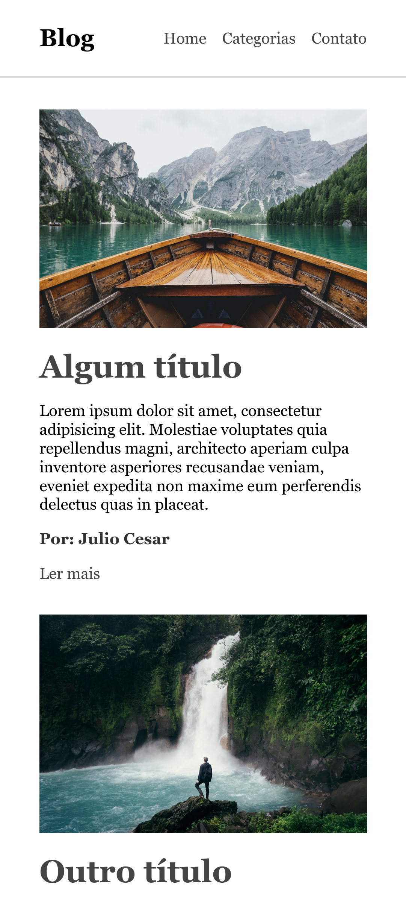
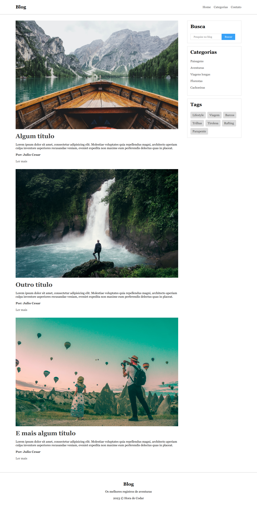

# Blog Semântico

Este é um projeto que representa um blog semântico com artigos de diferentes categorias e tags. A interface é construída com HTML e estilizada usando CSS.

## Como Usar

- Abra o arquivo `index.html` em um navegador da web para visualizar o blog semântico.
- O projeto é composto por páginas com artigos, categorias e tags. Você pode personalizar o conteúdo e adicionar seus próprios artigos.

## Tecnologias Utilizadas

- HTML
- CSS

## Estrutura do Projeto

A estrutura do projeto inclui os seguintes arquivos e pastas:

- `index.html`: A página HTML que contém o blog semântico.
- `css/style.css`: O arquivo CSS que define os estilos da página.
- `imagens/`: Uma pasta contendo as imagens utilizadas no blog.

## Responsivo

O projeto é responsivo e se adapta a diferentes tamanhos de tela.

## Rodapé

O rodapé exibe informações sobre o blog.

## Contribuições

Este projeto é fornecido apenas para fins de aprendizado.

## Licença

Este projeto não tem uma licença específica. Certifique-se de respeitar os direitos autorais das imagens e conteúdo utilizados no projeto.

---

2023 &copy; Hora de Codar

## Foto final mobile

## Foto final versão Notebook

